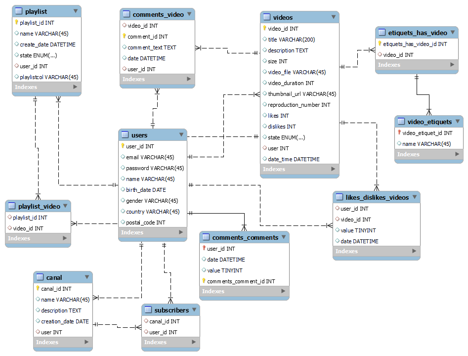

# YouTube-like Database Creation Script

This repository contains an SQL script to create the database schema for a YouTube-like application. The script defines the tables and relationships necessary to model user accounts, videos, playlists, comments, likes, and more.

## Table of Contents

- [Usage](#usage)
- [Database Structure](#database-structure)
- [Customization](#customization)
- [References](#references)
- [Note](#note)

## Usage

Follow these steps to create the YouTube-like database using the provided SQL script:

1. **Database Setup**: Ensure you have a MySQL database instance ready. You can use MySQL Workbench or any MySQL client of your choice.

2. **Run the Script**: Open your MySQL client and execute the SQL script provided in the `create_youtube_database.sql` file. This script will create all the necessary tables and relationships.

3. **Verify Database**: After executing the script, verify that the database and tables have been created as expected. You can use SQL queries or MySQL Workbench to inspect the schema.

## Database Structure

The script defines the following tables to model the YouTube-like application:

1. users: Stores user account information.
2. playlist: Represents playlists created by users.
3. videos: Contains information about uploaded videos.
4. playlist_video: Defines the relationship between playlists and videos.
5. video_etiquets: Holds video etiquet information.
6. likes_dislikes_videos: Tracks likes and dislikes for videos.
7. comments_comments_like_dislike: Manages likes and dislikes for comments.
8. etiquets_has_video: Maps etiquets to videos.
9. comments_video: Stores comments on videos.
10. canal: Represents user-created channels.
11. subscribers: Manages channel subscribers.

## Customization

Feel free to customize the SQL script to match your application's specific requirements. You can modify column names, data types, and even add new tables as needed. Keep in mind that modifying the schema might impact how your application functions.

## References

For more information about forward engineering SQL scripts using MySQL Workbench, you can refer to the official documentation:

- [MySQL Workbench Forward Engineering SQL Scripts](https://dev.mysql.com/doc/workbench/en/wb-forward-engineering-sql-scripts.html)

If you have questions about MySQL Workbench, consult the official FAQ:

- [MySQL Workbench FAQ](https://docs.oracle.com/cd/E19078-01/mysql/mysql-workbench/workbench-faq.html)

## Note

This script is intended as a foundation for creating a YouTube-like database schema. Make sure to back up your data before executing any database scripts, and consider testing the script in a controlled environment before deploying it to a production database.
